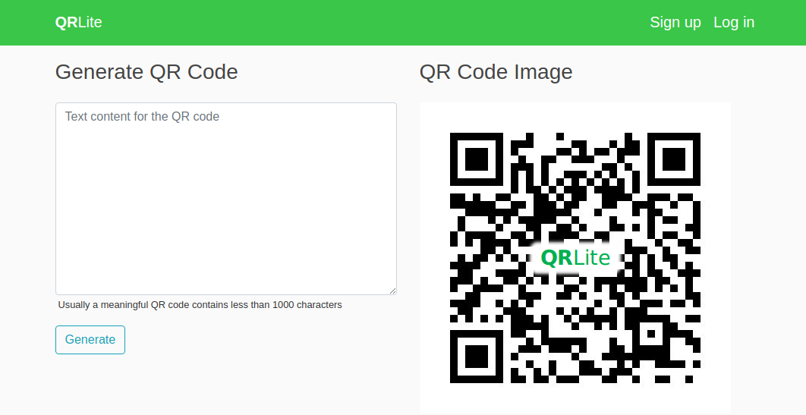

## QR Code Generator

#### About
A python library to generate QR Code with only 3 modes (numeric, alphanumeric, and utf-8)

QR Code generation process undergoes through data analysis, data encoding, and placement. For more details on the implementation, check it out [here](qrlite/QRlite.py).

Using PIL to generate QR code image files and save them under the qr_img directory. [Details](qrlite/util.py) about image generation implementation.

#### Project Extension
Fully functioning web application - [QRLite](http://45.79.54.153/) using [Django](https://www.djangoproject.com/) framework and guidance from [Corey Schafer](https://coreyms.com/)

#### Contributors
- Adapted from @[Project Nayuki](https://www.nayuki.io/page/qr-code-generator-library) | [Python Github Repository](https://github.com/nayuki/QR-Code-generator/tree/master/python)
- Followed this [tutorial](https://www.thonky.com/qr-code-tutorial/) | [Thonky.com](https://www.thonky.com/)
- QR Code international standard - [ISO 18004](https://www.swisseduc.ch/informatik/theoretische_informatik/qr_codes/docs/qr_standard.pdf)
